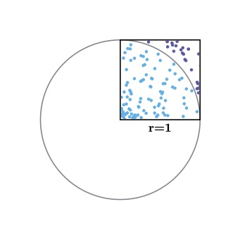
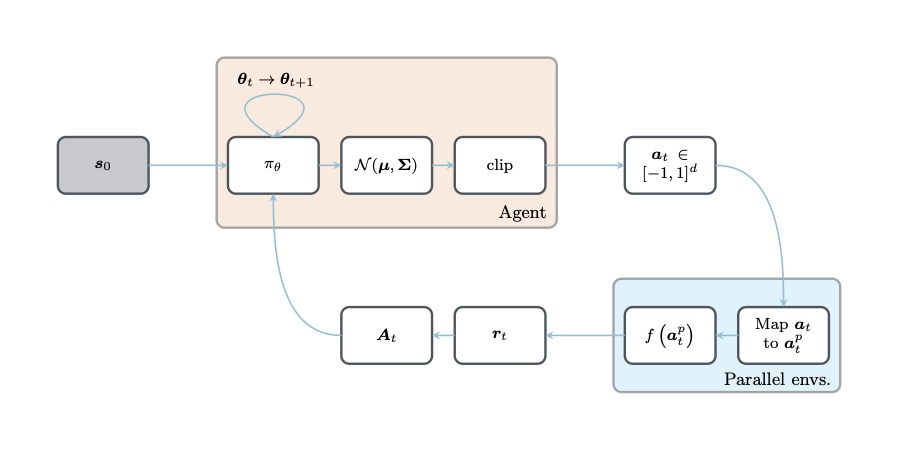
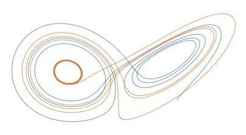
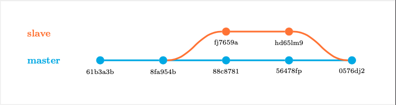

# latex_recipes

This repository contains a set of LaTeX templates, TikZ figures and pgfplots graphs that I have been using/drawing for my academic work.
They are for everyone to use/modify within the boundaries of academic work/publications (see license file). Every template or figure file is self-contained, to be easily exportable. There is absolutely no guarantee of optimality, and some figures won't support modifications without a lot of reworking/aligning. Below are icons of the figures and templates proposed in this repository, you can click on them to be re-directed to the code.

### Similar repositories:

- https://github.com/janosh/tikz
- https://github.com/f0nzie/tikz_favorites

## Figures

| [**`random.tex`**](data/random/random.tex)              | [**`network.tex`**](data/network/network.tex)           |
| :-----------------------------------------------------: | :-----------------------------------------------------: |
|                        |                     |
| [**`cnn.tex`**](data/cnn/cnn.tex)                       | [**`turek.tex`**](data/turek/turek.tex)                 |
|                                 |                           |
| [**`workflow.tex`**](data/workflow/workflow.tex)        | [**`lorenz.tex`**](data/lorenz/lorenz.tex)              |
|                  |                        |
| [**`git.tex`**](data/git/git.tex)                       | [**`minted.tex`**](data/minted/minted.tex)              |
|                                 |                        |
| [**`rosenbrock.tex`**](data/rosenbrock/rosenbrock.tex)  | [**`control.tex`**](data/control/control.tex)           |
|            |                     |
| [**`letter.tex`**](data/letter/letter.tex)              | [**`thesis.tex`**](data/thesis/thesis.tex)              |
|                        |                        |
| [**`beamer.tex`**](data/beamer/beamer.tex)              | [**`cfef.tex`**](data/cfef/cfef.tex)                    |
|                        |                              |
