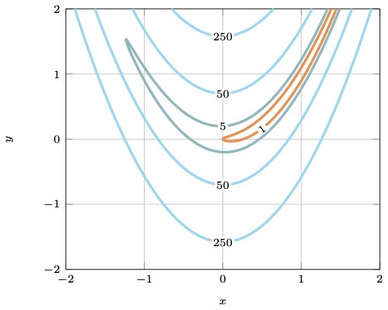
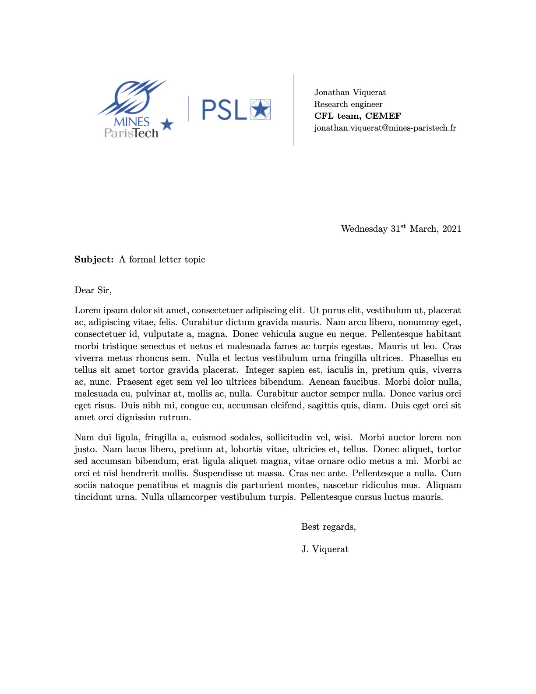

# latex_recipes

This repository contains a set of LaTeX templates, TikZ figures and pgfplots graphs that I have been using/drawing for my academic work.
They are for everyone to use/modify within the boundaries of academic work/publications (see license file). Every template or figure file is self-contained, to be easily exportable. There is absolutely no guarantee of optimality, and some figures won't support modifications without a lot of reworking/aligning. Below are icons of the figures and templates proposed in this repository, you can click on them to be re-directed to the code. You can also browse by categories using the directories above.

### Similar repositories:

- https://github.com/janosh/tikz

## Figures

  
  

 

  

  
  

## Plottings

  
  

  

## Templates

  
  

  

## Others

  

